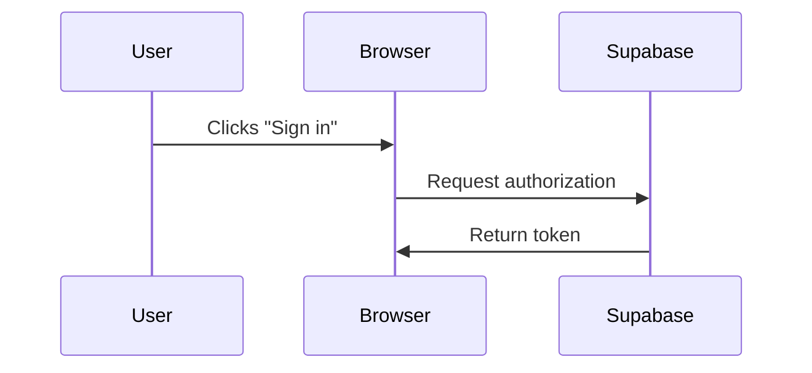
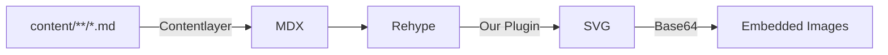

# Contributing to Supabase docs

Our docs help developers to get started and keep succeeding with Supabase. We welcome contributions from everyone.

If you'd like to contribute, see our list of [recommended issues](https://github.com/supabase/supabase/issues?q=is%3Aopen+is%3Aissue+label%3Adocumentation+label%3A%22help+wanted%22). We also welcome you to open a PR or a new issue with your question.

Here are some general guidelines on writing docs for Supabase.

## General principles

Write helpful, concise, and understandable documentation. We have a global audience whose members speak different native languages.

To make docs as clear as possible:

- Write for the user. Think about what task they want to complete by reading your doc. Tell them what, and only what, they need to know.
- Write like you talk. Conversational English is easier for a global audience to understand and localize. Many readers who use English as an additional language learn conversational rather than academic English. Use words and sentences that sound natural when speaking. Cut unnecessary words. Read your writing out loud to help you choose the clearest and simplest phrases.
- Prefer short, direct sentences. Express one relationship at a time, and avoid unnecessary compound structures. This makes each sentence easier to understand, localize, and interpret consistently.
- Cover one topic in each paragraph. Start a new paragraph whenever you change the topic. Don't worry about paragraphs being too short.
- Avoid using idioms and colloquialisms, such as `piece of cake`. These phrases are often specific to a region or culture.
- Refer to the reader as `you`. Don't use `we` to refer to the reader. Use `we` only to refer to the Supabase team.

## Document types

Supabase docs contain 4 types of documents. Before you start writing, think about what type of doc you need.

### Explainers

Explainers help the reader to learn a topic. They are conceptual and mostly prose-based. They can include:

- A description of _what_ a feature is
- Some reasons _why_ it is useful
- Some examples of _when_ to use it
- A high-level explanation of _how_ it works

Explainers don't include:

- Instructions on how to use it

### Tutorials

Tutorials are goal-oriented. They help a reader to finish a large, complex goal, such as setting up a web app that uses multiple Supabase features.

Tutorials mix prose explanations with procedures. Procedures are lists of steps for the reader to follow. Tutorials provide context for why certain instructions are given.

For inspiration, see [an example of a tutorial](https://supabase.com/docs/guides/getting-started/tutorials/with-nextjs).

### Guides

Guides are also goal-oriented, but they focus on shorter, more targeted tasks. For example, a guide might explain how to set up user login for an app.

Guides contain mostly procedures: concise steps that readers can follow in sequence.

Begin each guide with a sentence that declares its intent, such as `This guide explains how to set up email login.` This helps readers and agents confirm that the guide matches their goal and expected outcome.

Keep procedures focused on what the reader must do. Move substantial background or conceptual explanations into a separate section or an explainer. Cross-reference the authoritative explanation instead of repeating it in the procedure. This keeps the action path scannable, gives readers optional depth, and maintains one source of truth.

- Recommended: `This guide explains how to enable Row Level Security. To learn how Row Level Security controls access, see [Row Level Security](...).`
- Not recommended: Begin with several paragraphs about how Row Level Security works before stating what the guide helps the reader do.

**Mixed information types:** When a guide contains substantial context or reference material, group sections by information type. Keep contextual and reference sections separate from the procedure group so that background information doesn't interrupt the action path.

**Navigation:** Begin a long guide with a short outline of its major section groups. Link to each group and state when a reader should use it. Don't add section navigation to a short guide when the headings are already easy to scan.

**Cross-references and glue:** Connect contextual sections to their corresponding procedures when the relationship helps readers navigate. Add a brief introduction to each section group, a transition when the information type changes, and an outcome after a procedure. Add links selectively rather than linking every adjacent section.

For inspiration, see [an example of a guide](/docs/guides/auth/auth-email-passwordless).

### Reference

References are factual and to the point. Think of dictionary entries.

References include:

- Function parameters
- Return types
- Code samples
- Warnings about critical errors, such as missteps that can cause data loss

References don't include:

- Explanations of the context for a feature
- Examples of use cases
- Multi-step instructions

## Repo organization

Most docs pages are contained in the `apps/docs/content` directory. Some docs sections are federated from other repositories, for example [`pg_graphql`](https://github.com/supabase/pg_graphql/tree/master/docs). Reference docs are generated from spec files in the `spec` directory.

You can usually identify a federated or reference doc because it uses a Next.js dynamic route. For example, it might use `[[...slug]].tsx`. Look for the spec file import or the repo definition to find the content location.

Example spec file import:

```js
import specFile from '~/spec/transforms/analytics_v0_openapi_deparsed.json' with { type: 'json' }
```

Example repo definition:

```js
const org = 'supabase'
const repo = 'pg_graphql'
const branch = 'master'
const docsDir = 'docs'
const externalSite = 'https://supabase.github.io/pg_graphql'
```

Check the sections for [guide structure](#guide-structure) and [reference structure](#reference-structure) to learn more about the file structures.

## Guide structure

The Supabase docs use [MDX](https://mdxjs.com/). Guides are MDX documents that combine concise prose with structured procedures.

Adding a new guide requires:

- YAML frontmatter
- A navigation entry in a separate file

Frontmatter looks like this. `title` is mandatory. There are also optional properties that you can use to control the page display, including `subtitle`, `tocVideo`, and `hideToc`.

```yaml
---
title: How to connect to Supabase
hideToc: true
---
```

The navigation is defined in [`NavigationMenu.constants.ts`](https://github.com/supabase/supabase/blob/master/apps/docs/components/Navigation/NavigationMenu/NavigationMenu.constants.ts).

Add an entry with the `name`, `url`, and optional `icon` for your page.

## Reference structure

Reference docs are produced from the reference specs and library source code. A common spec file contains shared function and endpoint definitions, and library-specific spec files contain further details.

### Common spec file

Each type of library, such as a language SDK or CLI, has a common spec file. For example, see the [spec file for the language SDKs](https://github.com/supabase/supabase/blob/master/apps/docs/spec/common-client-libs-sections.json). This file contains definitions for the common SDK functions:

- `id`: Identifies the function
- `title`: Provides the human-readable title
- `slug`: Provides the URL slug
- `product`: Identifies the Supabase product that owns the function. For example, database operations are owned by `database`, and Auth operations are owned by `auth`.
- `type`: Uses `function` for a structured function definition or `markdown` for a prose explainer section

To add a new function, manually add an entry to this common file.

### Specific spec file

Each library also has its own spec file containing library-specific details. For example, see the [JavaScript SDK spec file](https://github.com/supabase/supabase/blob/master/apps/docs/spec/supabase_js_v2.yml).

The functions listed in this file match the ones defined in the common spec file.

Each function contains a description, code examples, and optional notes. The parameters are pulled from the source code via the `$ref` property, which references a function definition in the source code repo. These references are pulled down and transformed using commands in the spec [Makefile](https://github.com/supabase/supabase/blob/master/apps/docs/spec/Makefile). Unless you're a library maintainer, you don't need to worry about this.

If you're a library maintainer, follow these steps when updating function parameters or return values:

1. Merge your changes into the library's `master` branch.
2. Wait for the action to update the specification in the `gh-pages` branch.
3. Run `make` from `apps/docs/spec` in the `supabase/supabase` repository.
4. Verify the changes on your local documentation site.

## Content reuse

If you copy the same content multiple times across different files, create a **partial** for content reuse instead. Partials are MDX files contained in [`apps/docs/content/_partials`](https://github.com/supabase/supabase/tree/master/apps/docs/content/_partials). They contain reusable snippets that can be inserted in multiple pages. For example, you can create a partial to define a common setup step for a group of tutorials.

To use a partial, import it into your MDX file. You can also set up a partial to automatically import by including it in the `components` within [`apps/docs/features/docs/MdxBase.shared.tsx`](https://github.com/supabase/supabase/blob/master/apps/docs/features/docs/MdxBase.shared.tsx).

## Components and elements

Docs include normal Markdown elements such as lists and custom components such as admonitions, also known as callouts.

Here are some guidelines for using elements:

### Admonitions

Admonitions draw reader attention to an important point or an aside. They highlight important information, but get less effective if they're overused.

Use an admonition when a reader might otherwise miss information that affects the outcome of their task, or when you want to separate helpful but optional guidance from the main flow. Don't use an admonition for information that belongs in the main explanation or procedure.

Use admonitions sparingly. Don't stack them on top of each other or use them as decoration.

Begin every admonition with its impact and purpose: the "so what." Use the first sentence to tell the reader why the information matters, such as what could happen, what changes, or what benefit they gain. Add background or instructions after the impact is clear.

For example:

- Recommended: `Deleting this project permanently removes its database and backups. Export any data that you want to keep before you continue.`
- Not recommended: `Before you continue, there are a few things that you should know about project deletion.`

Choose the appropriate `type` for your admonition:

- `danger`: Warn about actions or conditions that could cause data loss, expose sensitive data, or create another severe and difficult-to-reverse outcome. State the consequence first, and then explain how to avoid it.
- `deprecation`: Identify a deprecated feature or behavior. State how the change affects the reader, and then provide the supported alternative or migration path.
- `caution`: Warn about behavior that could cause bugs, failed operations, unexpected results, or serious inconvenience but doesn't rise to the severity of `danger`.
- `tip`: Share an optional shortcut, optimization, or best practice that helps the reader complete the task more effectively. The main procedure must still work without it.
- `note`: Highlight an important prerequisite, constraint, or clarification that doesn't represent a risk. If the information is essential to completing a step, include it in the procedure instead.

```
<Admonition type="note" title="Optional title">

Your content here

</Admonition>
```

### Blockquotes

Don't use blockquotes.

### Code blocks

Keep code lines short to avoid scrolling. For example, you can split long shell commands with `\`.

- **JavaScript/TypeScript**

  The `supabase` repository uses Prettier, which also formats JS/TS in code blocks. Your PR is blocked from merging if the Prettier check fails. From the repository root, run `pnpm format`, or set up automatic formatting in your IDE.

- **SQL**

  Prefer lowercase for SQL. For example, `select * from table` rather than `SELECT * FROM table`.

Optionally specify a filename for the code block by including it after the opening backticks and language specifier:

````md
```ts environment.ts

```
````

Optionally highlight lines by using `mark=${lineNumber}`.

````md
```js mark=12:13

```
````

### Emphasis

Use **bold**, _italics_, and `code` formatting for distinct purposes. Don't use them interchangeably or to add visual emphasis alone.

- **Bold**: Mark UI labels the reader interacts with, such as buttons, menu items, and field names. For example, `Click **Save**.` Also use bold for a term the reader must not miss, such as `**Never** commit your service role key.`
- _Italics_: Introduce a new term the first time you define it, or reference a title, such as a book or a third-party product name written in italics by convention. Use italics sparingly. Don't use italics for UI labels or for general emphasis.
- `Code`: Mark anything the reader types or copies verbatim, or anything the system reads literally. This includes filenames, paths, commands, flags, environment variables, function and parameter names, configuration keys, and literal values. For example, `` Set `SUPABASE_URL` in your `.env` file. ``

If a phrase fits more than one category, pick the most specific one. A command name is `code`, not **bold**, even though the reader also interacts with it.

### Content listings

Overview and index pages use a single `<ContentListings id="..." />` component for curated link sections such as "Get started", "Next steps", "Examples", or "Resources". Refer to [`storage.data.ts`](data/content-listings/storage.data.ts) and [`storage.mdx`](content/guides/storage.mdx) for a full example.

**Prompt to add content listings:**

```text
Add a content listing block for [TOPIC] / [SECTION]. For example, use Storage / Examples.
Follow CONTRIBUTING § Content listings in apps/docs.
Copy structure from `storageGetStarted` in apps/docs/data/content-listings/storage.data.ts.
Pick a globally-unique kebab-case id like `[topic]-[section]`.
Run `pnpm test:local lib/content-listings.test.ts` from apps/docs.
```

**Manually add content listings:**

1. Add or update a `ContentListingGroup` export in [`data/content-listings/[topic].data.ts`](data/content-listings/). The `id` field must be globally unique across all listing groups. For example, use `storage-get-started` rather than `get-started`. The ID is both the lookup key and the telemetry `listingId`.
2. Place the component inline in guide MDX, for example `<ContentListings id="storage-get-started" />`. Use a partial only when the block is reused or gated with `$Show` at the partial level.
3. Run `pnpm test:local lib/content-listings.test.ts` from `apps/docs`.

Code snippets for manually adding content listings are available in [`.vscode/content-listing.code-snippets`](../../.vscode/content-listing.code-snippets). Use `cl-data` for a data export with a namespaced ID. Use `cl-inline` for an MDX component.


### Footnotes

Don't use footnotes.

### Graphs

Render diagrams, including flowcharts, sequence diagrams, and entity-relationship diagrams, by writing a fenced code block with `mermaid` as the language. The MDX renderer routes these blocks through the shared `Mermaid` component, so theming follows light and dark mode automatically.

For the full list of supported diagram types and their syntax, see the [official Mermaid diagram reference](https://mermaid.js.org/intro/syntax-reference.html).

Sequence diagram:

````mdx

````

The `flowchart` keyword accepts a direction such as `LR` or `TD`:

````mdx

````

A few tips:

- Use a standard Mermaid diagram keyword, such as `sequenceDiagram`, `flowchart`, or `erDiagram`, on the first line of the block.
- Keep diagrams focused on a single flow or concept. If a diagram gets too dense, split it into multiple smaller diagrams.
- Wrap node labels that contain special characters in double quotes. Special characters include `*`, `/`, spaces, and punctuation. For example, use `A["content/**/*.md"]`.
- Don't hardcode colors. The component themes the diagram automatically so it matches both light and dark mode.
- Use diagrams to support the prose, not replace it. Explain the key takeaway in text near the diagram.

### Images

Images are uploaded in the `apps/docs/public/img` folder.

For vector illustrations, use `.svg` files. For screenshots and non-vector graphics, use `.png` files. Supported browsers receive `.webp` versions automatically.

Redact any sensitive information, such as API keys.

### Links

Use descriptive link text that tells the reader where the link goes. This is important for accessibility. For example, don't use `here` as link text.

Keep link text concise. Use the shortest part of the link that is descriptive enough. For example, `see the [reference section](/link)` rather than `[see the reference section](/link)`.

Don't include the `https://supabase.com` origin when linking to pages on `supabase.com`. Use a `/docs/...` path for a page in Supabase docs, such as `[getting started](/docs/guides/getting-started)`. Use a site-root path for a page outside docs, such as `[open the Supabase Dashboard](/dashboard)`.

### Procedures

Use a procedure when a human or agent must perform actions to reach an outcome. The procedural format makes that expectation explicit.

Write sequential actions as an ordered list. Begin each step with an imperative verb, and include one action or a closely related set of actions per step. Give the reader enough context to know where to act.

Apply the [Information Mapping chunking principle](https://informationmapping.com/blogs/news/writing-for-the-web-the-magical-number-seven-plus-or-minus-two) to procedures. Present 7 ± 2 related steps at a time. This gives readers a manageable chunk of five to nine actions. Aim for the lower end of the range when the task is complex or unfamiliar.

If a procedure has more than nine steps, group related steps into named phases or smaller procedures. If one step contains multiple distinct actions, split it into separate steps. Don't add steps to reach a minimum. The range is a guideline for organizing information, not a required procedure length.

An apparent one-step procedure can become two steps when there is a real orientation action. For example:

1. Open a terminal in your project directory.
2. Run `supabase start`.

The first step establishes the operating context for both readers and agents. Don't add a redundant orientation step to a genuinely atomic instruction. For example, write `Click **Save**.` instead of adding `Locate the **Save** button` as a separate step.

### Lists

Use ordered lists for steps that must be taken one after the other. Use unordered lists when order doesn't matter.

Use Arabic numerals (`1`, `2`, `3`) for ordered lists and dashes (`-`) for unordered lists.

Don't nest lists more than two deep.

```md
1. List item
2. List item
   1. List item
   2. List item
3. List item
   - List item
   - List item
     <!-- DON'T ADD ANOTHER LEVEL OF NESTING -->
     - Overly nested list item
```

### Tabs

Use tabs to provide alternative instructions for different platforms or languages.

The optional `queryGroup` prop lets you link directly to a tab. For this example, use `/docs/my-page?packagemanager=npm`.

```
<Tabs
  scrollable
  size="small"
  type="underlined"
  defaultActiveId="npm"
  queryGroup="packagemanager"
>
<TabPanel id="npm" label="npm">

// ...

</TabPanel>
<TabPanel id="yarn" label="Yarn">

// ...

</TabPanel>
</Tabs>
```

### Videos

Include videos as table of contents (TOC) videos instead of placing them in the main text.

You can define a TOC video in the page frontmatter:

```yaml
---
tocVideo: 'rzglqRdZUQE'
---
```

## Styling, formatting, and grammar

Grammar is useful when it makes your writing clearer. Use complete sentences by default because they identify the actor and action. This reduces ambiguity for readers, translators, and agents. Use sentence fragments only where they improve scanning, such as headings, labels, or short list items.

Headings guide the reader's eye and organize the page, but they don't carry information by themselves. Make the content beneath a heading understandable without relying on the heading. The first sentence can restate the heading, even if it sounds redundant. Readers often skim headings and then return to the section that interests them, so use the opening sentence to confirm the context.

Don't use parentheses for asides or supplementary information. Rewrite that information as part of the sentence or as a separate sentence. Use parentheses to introduce an acronym after spelling out its meaning, such as full-text search (FTS), or to mark an item as `(Optional)`. Parentheses that are required by Markdown links or code syntax aren't prose parentheticals.

That said, a few rules help keep the docs concise, consistent, and clear:

- Format headings in sentence case. Capitalize the first word and any proper nouns. All other words are lowercase. For example, `Set up authentication` rather than `Set Up Authentication`.
- Use the Oxford comma. Place a comma before the `and` that marks the last item in a list. For example, use `functions, tables, and indexes` rather than `functions, tables and indexes`.
- Use the present tense as much as possible. For example, `the AI assistant answers your question` rather than `the AI assistant will answer your question`.

## Word usage and spelling

Use American English. If in doubt, consult the [Merriam-Webster dictionary](https://www.merriam-webster.com/).

Follow the [Supabase documentation word list](./WORD_LIST.md) for preferred spelling, capitalization, and usage. The word list includes the terminology rules checked by `supa-mdx-lint`. Run `pnpm lint:mdx` in `apps/docs` to check your changes.

## Search

Search uses a Supabase instance. During CI, [a script](https://github.com/supabase/supabase/blob/master/apps/docs/scripts/search/generate-embeddings.ts) collects guides, reference documentation, and other content. The script creates OpenAI embeddings and stores the search index in a Supabase database.

Search combines native Postgres full-text search (FTS) with embedding similarity search based on [`pgvector`](https://github.com/pgvector/pgvector). At runtime, a PostgREST call invokes the weighted FTS RPC. An [Edge Function](https://github.com/supabase/supabase/tree/master/supabase/functions) runs the embedding search.
